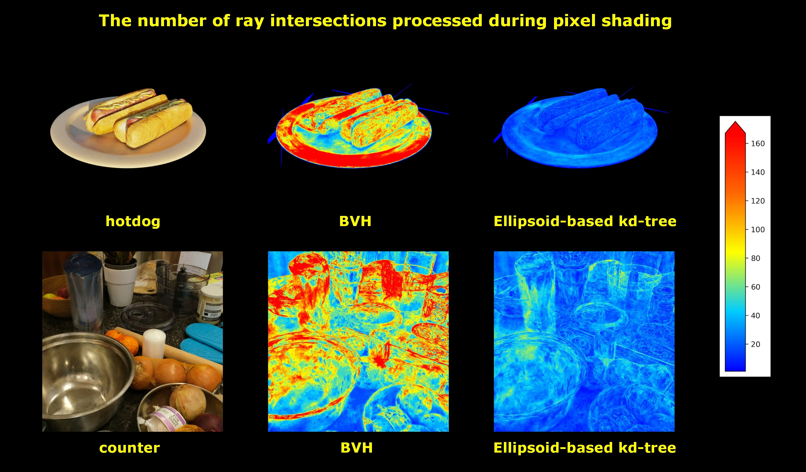

# Kd-tree based 3D Gaussian Ray Tracing

https://github.com/user-attachments/assets/bd751504-18ee-49ac-b190-c9261a7c3992

<p align="center">
  
</p>

## Overview
기존 3D 가우시안 레이트레이싱의 한계를 극복하기 위해 설계된 kd-tree 기반 3D 가우시안 레이트레이싱 파이프라인입니다.

표준 그래픽스 API가 제공하는 레이트레이싱 파이프라인은 일반적으로 가속 구조(Acceleration Structure)로 BVH를 사용합니다. 하지만 노드 간 공간 중첩을 허용하는 BVH의 특성상, 픽셀 단위의 깊이 정렬과 누적 연산이 필수적인 3D 가우시안 볼륨 렌더링 환경에서는 과도한 교차 검사(Intersection)와 트리 탐색 오버헤드가 발생하는 구조적 비효율성이 존재합니다. 

본 프로젝트는 이러한 하드웨어 가속 BVH의 한계를 우회하여 가속 구조를 공간 분할 방식인 KD-Tree로 대체하고, 3D 가우시안 특성에 최적화된 빌드 알고리즘과 레이트레이싱 파이프라인을 새롭게 구축하여 렌더링 성능을 극대화했습니다.

## Tech Stack
- **Language:** C/C++
- **GPU API:** CUDA, OpenGL
- **Key Concepts:** Realtime Ray Tracing, KD-Tree, 3D Gaussian Splatting

## Key Implementations

**Hybrid KD-Tree Construction**  
메쉬 변환 방식으로 인한 메모리 오버헤드를 해결하기 위해 구조를 재설계했습니다. 공간 분할 단계에서는 삼각형 프록시를 기준으로 계산하여 트리의 품질을 확보하고, 최종 리프 노드에는 삼각형 대신 3D 가우시안 원본 데이터를 저장하여 데이터 폭증을 억제했습니다.

**Volume-rendering-aware SAH**  
KD-Tree 빌드 시 분할 평면 후보 비용 산출 식(SAH)을 볼륨 렌더링 특성에 맞게 변형하여 트리의 품질을 높였습니다.

## Getting Started

### Prerequisites
- Windows 10/11
- Visual Studio 2022
- CUDA Toolkit 13.0

### Code Structure
```text
.
├── Kd-treeConverter_v0.9/Kd-treeConverter
│   ├── Kd-treeConverterMain.cpp    # 프로그램 진입점 및 렌더링 초기화
│   ├── Kd-treeConstructor.cpp      # 하이브리드 Kd-tree 빌드 및 SAH 평가 로직
│   └── cudaRenderer.cu             # CUDA 기반 광선-가우시안 교차 검사 및 렌더링 커널
